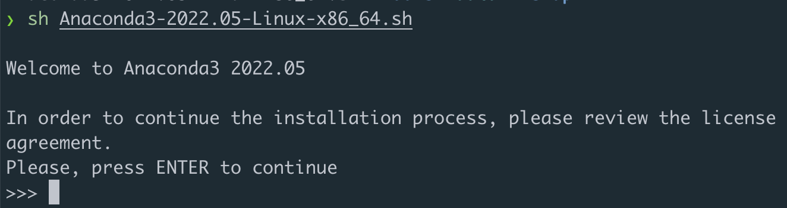
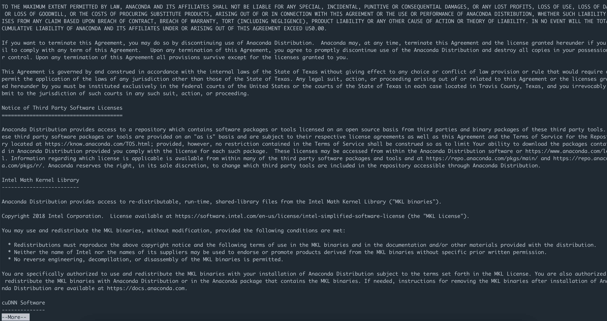
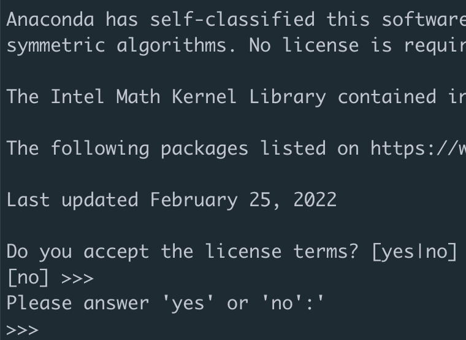
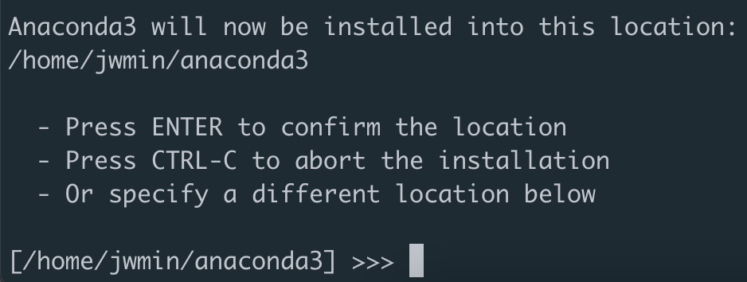
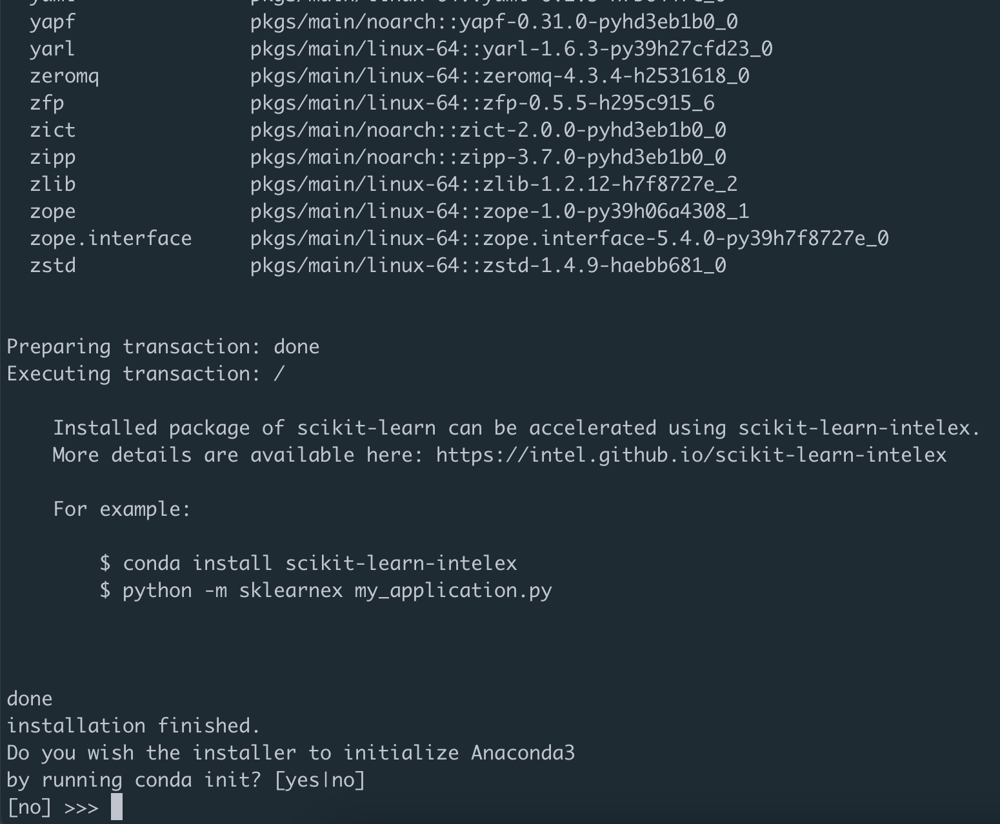
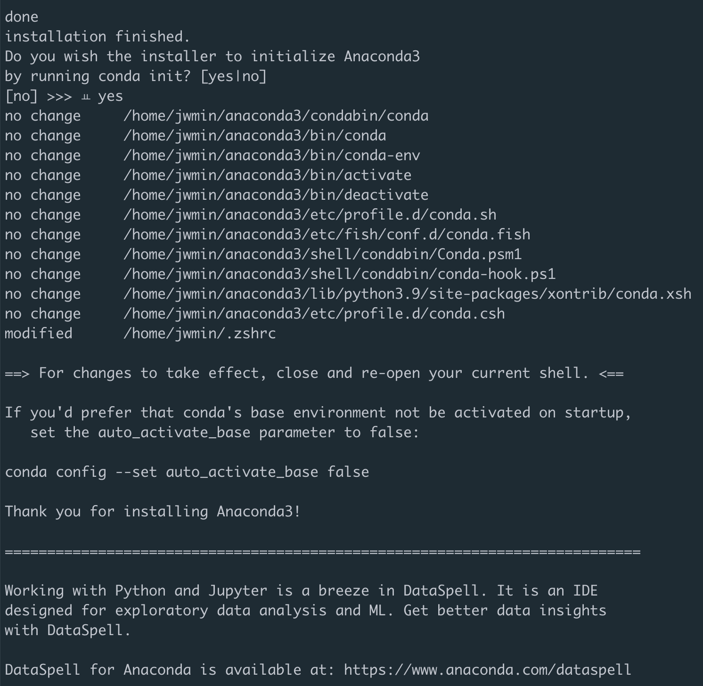

## 우분투 터미널에 아나콘다 설치

<br>

1. 아나콘다 공식 사이트 접속 [anaconda.com](https://www.anaconda.com/products/distribution)      

2. `64-Bit (x86) Installer (659 MB)` 우클릭 후 `링크 주소 복사`
   <p align="center"></p>
   
3. 터미널에서 해당 파일 다운받기

   ```console
   wget https://repo.anaconda.com/archive/Anaconda3-2022.05-Linux-x86_64.sh
   ```

4. 아나콘다 설치     
 
   ```console
   sh Anaconda3-2022.05-Linux-x86_64.sh
   ```
   + 설치 시작
        <p align="center"></p>
   + 라이센스 부분 : <ENTER> 누르기
        <p align="center"></p>
   + 라이센스 동의 : `yes` 입력
        <p align="center"></p>
   + 설치경로 : `yes` 입력
        <p align="center"></p>
   + `bashrc`에 환경변수 등록 : `yes` 입력
        <p align="center"></p>
   + 설치 완료
        <p align="center"></p>

<br>

## 터미널 실행 시 자동으로 conda base가 실행되도록 하기

<br>

1. bashrc 편집해주기      
    
   ```console
   vim ~/.bashrc
   ```

2. bashrc 설정 파일에 아래 내용 추가하기
   ```console
   # >>> conda initialize >>>
   # !! Contents within this block are managed by 'conda init' !!
   __conda_setup="$('/home/jwmin/anaconda3/bin/conda' 'shell.bash' 'hook' 2> /dev/null)"
   if [ $? -eq 0 ]; then
       eval "$__conda_setup"
   else
       if [ -f "/home/jwmin/anaconda3/etc/profile.d/conda.sh" ]; then
           . "/home/jwmin/anaconda3/etc/profile.d/conda.sh"
       else
           export PATH="/home/jwmin/anaconda3/bin:$PATH"
       fi
   fi
   unset __conda_setup
   # <<< conda initialize <<<
   ```

3. 변경사항 적용하기     
   cf. `source` 명령어는 스크립트 파일을 수정한 후에 수정된 값을 바로 적용하기 위해 사용하는 명령어     
   [(출처)](https://klero.tistory.com/entry/source-%EB%AA%85%EB%A0%B9%EC%96%B4%EB%9E%80)  
   ```console
   source ~/.bashrc
   ```

<br>

참고자료 : https://thinmug.tistory.com/51#:~:text=Anaconda%20%EC%84%A4%EC%B9%98&text=%EB%82%B4%EA%B0%80%20%ED%95%84%EC%9A%94%ED%95%9C%20%EA%B2%83%EC%9D%80%20Linux%EC%97%90,Bit(x86)%20Installer%20%EC%9D%B4%EB%8B%A4.&text=%EB%B3%B5%EC%82%AC%ED%95%9C%20%EB%A7%81%ED%81%AC%EB%A5%BC%20%EC%9D%B4%EC%9A%A9,%EB%AA%85%EB%A0%B9%EC%96%B4%EB%A5%BC%20%EC%82%AC%EC%9A%A9%ED%95%B4%20%EB%8B%A4%EC%9A%B4%EB%B0%9B%EB%8A%94%EB%8B%A4.&text=%EC%9D%B4%EC%A0%9C%20%EC%95%84%EB%82%98%EC%BD%98%EB%8B%A4%EB%A5%BC%20%EC%84%A4%EC%B9%98%ED%95%9C%EB%8B%A4.&text=%EC%95%84%EB%82%98%EC%BD%98%EB%8B%A4%20%EC%84%A4%EC%B9%98%EA%B0%80%20%EC%99%84%EB%A3%8C%EB%90%98%EC%97%88%EB%8B%A4.