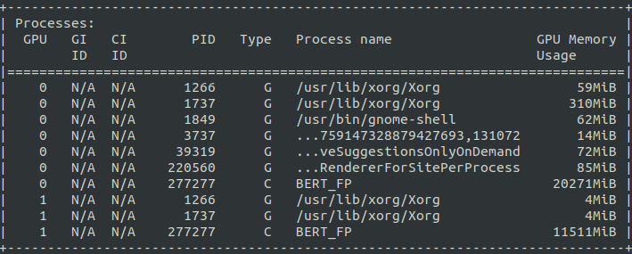

## 프로세스 이름 설정하기
nvidia-smi 등으로 GPU 사용 현황을 확인할 때 현재 실행시키는 코드의 프로세스 이름을 원하는대로 등록해주기    
<p align="center"></p>

<br>

1. 실행하고자 하는 스크립트에서 `setproctitle` 임포트
   ```python
   from setproctitle import setproctitle
   ```   

2. 스크립트의 상단에 setproctitle('프로세스이름') 추가
   ```python
   setproctitle('lm_pretraining')
   ```   

3. nvidia-smi로 프로세스 확인 시 `Process name`란에 lm_pretraining이라는 이름으로 뜨게 됨

<br>

출처 : https://github.com/hanjanghoon/BERT_FP
