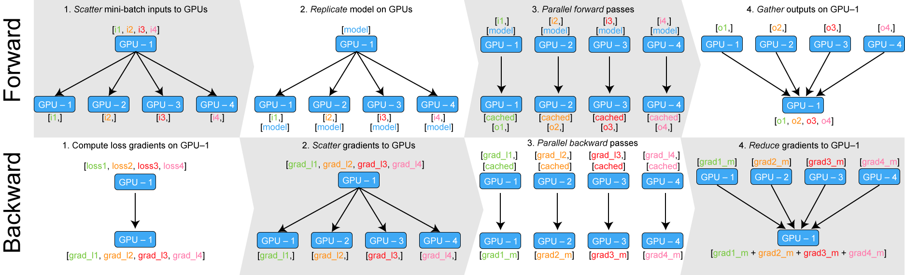

## GPU 두 개 이상 사용하기     
PyTorch에서는 multi-gpu 학습을 위한 Data Parallel이라는 기능을 제공함.   
<p align="center"></p>

### DataParallel(model) 하면 일어나는 일

```python
def data_parallel(module, input, device_ids, output_device):
   replicas = nn.parallel.replicate(module, device_ids)
   inputs = nn.parallel.scatter(input, device_ids)
   replicas = replicas[:len(inputs)]
   outputs = nn.parallel.parallel_apply(replicas, inputs)

   return nn.parallel.gather(outputs, output_device)
```
* 여러 개의 GPU에서 모델을 실행하기 위해 모델을 각 GPU에 할당 (`'replicate'`).      
* 그런 다음 batch를 GPU의 개수만큼 나눔 (`‘scatter’`).       
* 각 GPU에 대해 데이터를 나눈 후에는 각각 따로 forward를 진행하게 됨 (`'parallel apply'`).          
* 각각의 GPU에 있는 모델은 따로 연산한 후 output을 내게 됨. 모델은 loss function을 통해 모델의 output과 정답 간의 차이를 비교하여 loss를 구할 수 있는데, 이때 GPU 각각에서 loss와 gradient가 계산되는 것임. 계산되는 여러 개의 gradient 또한 하나의 device에 모여 모델이 업데이트 됨 (`'gather'`). 

<br>

1. 필요한 모듈 임포트    
   ```python
   import torch
   from torch import nn
   ```

2. 모델 선언
   ```python
   model = AutoModel.from_pretrained('bert-base-uncased') 
   ```

3. 디바이스 및 사용 가능한 GPU 개수 확인     
   ```python
   if local_rank == -1:
      device = torch.device("cuda" if torch.cuda.is_available() else "cpu")
   n_gpu = torch.cuda.device_count()
   ```

4. 모델을 각 GPU로 할당    
   ```python
   model.to(device)
   if local_rank != -1:
      model = torch.nn.parallel.DistributedDataParallel(model, device_ids=[local_rank], output_device=local_rank)
   elif n_gpu > 1:
      model = torch.nn.DataParallel(model) 

   # 1번 GPU에 출력 모으기 : 1번 GPU의 메모리 사용량이 늘어날 것
   # model = torch.nn.DataParallel(model, output_device=1)

   # 선택한 GPU에만 할당하는 방법
   # import os
   # os.environ["CUDA_VISIBLE_DEVICES"]="0,1,2,3" # 스크립트 상단에 추가

   # 스크립트에 추가하지 않고 코드 실행 시 GPU 할당해주는 방법
   # CUDA_VISIBLE_DEVICES=0,1 python test1.py  # GPU 0 and 1 사용.
   ```

5. (CPU에 있었던) 입력을 GPU로 보내주기
   ```python
   for data in tqdm(train_loader, desc="train"):
      input_ids = data["input_ids"].to(device)
      attention_mask = data["attention_mask"].to(device)
      targets = data["target"].to(device)

      outputs = model(
          input_ids=input_ids,
          attention_mask=attention_mask,
          labels = targets
      )
   ```   

6. 각 GPU에서 계산된 loss를 평균내기
   ```python
   loss = outputs[0] # varies depending on the models you use
   if args.n_gpu > 1:
      loss = loss.mean()
   ```   

<br>

출처 : https://medium.com/daangn/pytorch-multi-gpu-%ED%95%99%EC%8A%B5-%EC%A0%9C%EB%8C%80%EB%A1%9C-%ED%95%98%EA%B8%B0-27270617936b     
https://kongsberg.tistory.com/7     
https://cryptosalamander.tistory.com/147 