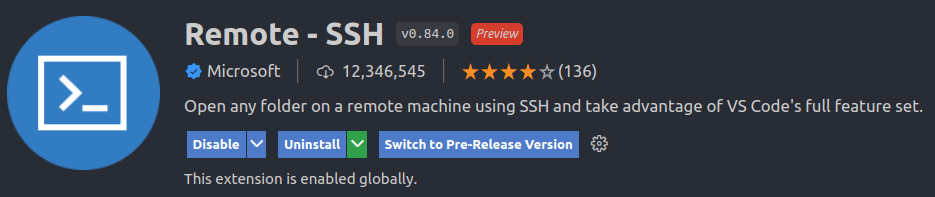
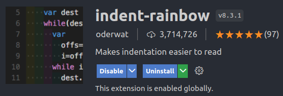

## vscode extensions

1. Remote-SSH     
   원격 접속      
   

    

2. Jupyter
   vscode에서 주피터 노트북 사용
   

    

3. Indent-rainbow
   indentation 색 입혀주기
   

    

4. Better Comments
   주석 네 가지 색으로 보이기
   

    

5. Excel Viewer         
   vscode에서 엑셀 보기        
   

 