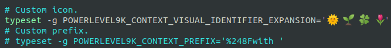

## powerlevel 9k 커스텀

<br>

1. 설정파일 수정하기
   ```console
   vim ~/.p10k.zsh
   ```

2. 내용 수정
   typeset 부분 수정,..., etc.

3. 설정 저장
   ```console
   source ~/.p10k.zsh
   ```

4. 결과
   <p align="center"></p>

   <p align="center"></p>    

참고자료 : https://github.com/romkatv/powerlevel10k     
참고자료 : https://unicode-table.com/en/
